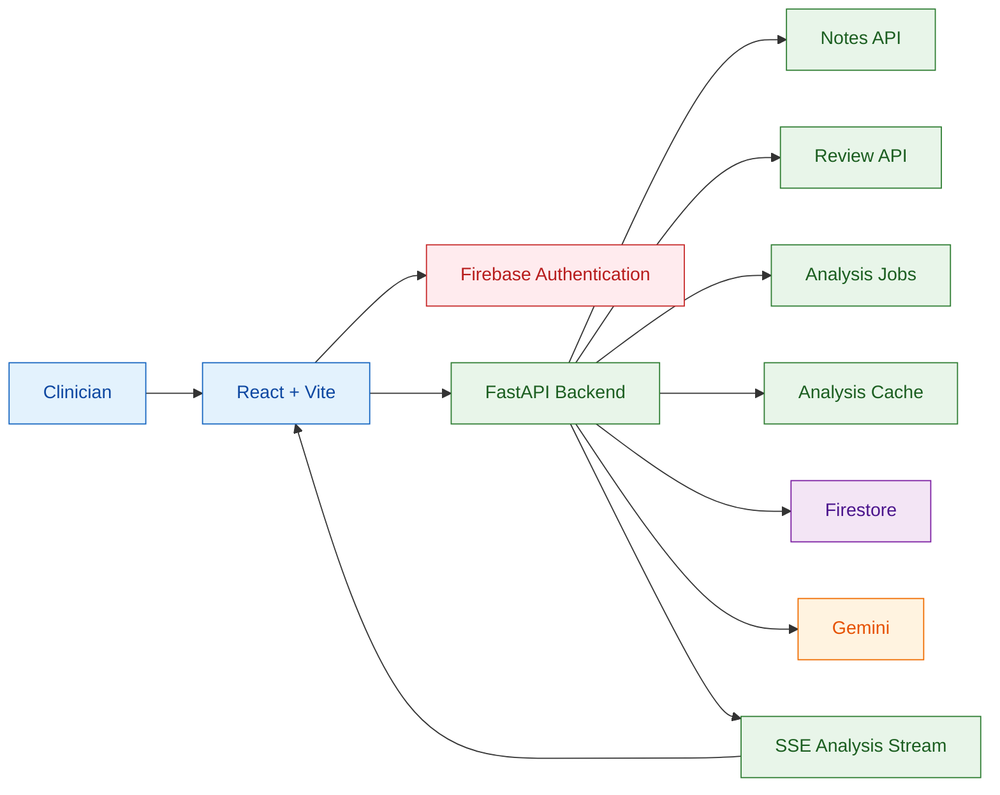
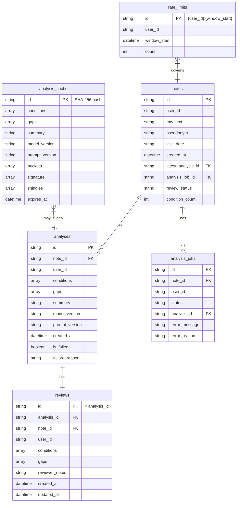

# Note Insight

## Overview

Note Insight is an AI-powered clinical note analysis application. A clinician pastes free-text clinical notes into the interface, and the application uses Google Gemini to extract structured information: potential conditions, verbatim evidence quotes, documentation status, suggested ICD-10 codes, confidence scores, and actionable documentation gaps, plus a concise clinical summary.

The application is built as a full-stack demo with a React frontend, FastAPI backend, Firestore database, and Gemini structured output. Every AI-generated item is presented for clinician review and correction.

## User Journey

1. **Login** — Authenticate with Firebase Auth.
2. **Submit note** — Paste raw clinical text, optionally add a pseudonym and visit date.
3. **Streaming analysis** — Open an SSE connection to receive a progressive summary and final structured analysis (conditions, evidence, gaps, ICD-10, confidence).
4. **Human review** — Accept, edit, reject, or add conditions; review documentation gaps; add reviewer notes.
5. **History** — Browse past notes and their analysis/review status.

## Features

- **Firebase Authentication** — Email/password Firebase Auth providers.
- **Note submission** — Validated input (≤20,000 characters, ≤6,000 words, pseudonym PHI guards).
- **Structured Gemini analysis** — Conditions, evidence quotes, documentation status, suggested ICD-10, confidence, documentation gaps, and clinical summary.
- **Evidence verification** — Every evidence quote is checked against the source note; hallucinated quotes are flagged `quote_verified=False` but preserved for clinician awareness.
- **Streaming SSE** — Progressive summary delivery via Server-Sent Events with polling fallback for late-connecting clients.
- **Retry and failure handling** — Provider-aware 429 retry with parsed delay (capped at 30s), validation retry with `CORRECTION REQUIRED` prompt, and categorized failure reasons (`rate_limited`, `invalid_output`, `timeout`, `provider_error`, `unknown`).
- **Human review** — Accept, edit, reject, or add conditions; edit gaps; add reviewer notes.
- **History and reanalysis** — List past notes, view details, and re-run analysis on demand.
- **Exact and similar caching** — SHA-256 exact-match cache and LSH/MinHash near-duplicate cache with conservative safety checks to reduce redundant Gemini calls.
- **Correction metrics** — Per-user aggregation of accepted, edited, rejected, and added conditions.
- **Per-user data isolation** — Every Firestore read is scoped to the authenticated user with ownership checks.
- **Rate limiting** — Configurable per-user analysis request limits enforced via Firestore transactions.

## Architecture

### HLD — System Architecture



### LLD — AI Analysis Pipeline

```mermaid
flowchart LR
    classDef frontend fill:#e3f2fd,stroke:#1565c0,color:#0d47a1
    classDef backend fill:#e8f5e9,stroke:#2e7d32,color:#1b5e20
    classDef ai fill:#fff3e0,stroke:#ef6c00,color:#e65100
    classDef db fill:#f3e5f5,stroke:#7b1fa2,color:#4a148c
    classDef security fill:#ffebee,stroke:#c62828,color:#b71c1c

    note[Note raw_text]:::db
    job[AnalysisJob<br/>pending → processing]:::db
    exact[Exact Cache Lookup<br/>SHA-256 hash]:::db
    similar[Similarity Cache<br/>LSH / MinHash]:::db
    gemini[Gemini Stream<br/>SUMMARY + DATA JSON]:::ai
    parse[Parse & Strip<br/>Markdown / DATA:]:::backend
    schema[Schema Validation<br/>GeminiRawResponse]:::backend
    evidence[Evidence Verification<br/>quote_verified]:::backend
    retry[Retry / Failure<br/>CORRECTION REQUIRED<br/>or invalid_output]:::backend
    persist[Persist Analysis<br/>+ Update Note]:::db
    sse_event[SSE Completion<br/>token / complete / error]:::backend

    note --> job
    job --> exact
    exact -- miss --> similar
    similar -- miss --> gemini
    exact -- hit --> persist
    similar -- safe hit --> persist

    gemini --> parse
    parse --> schema
    schema -- valid --> evidence
    schema -- invalid --> retry
    retry -- attempt 2 --> gemini
    retry -- max attempts --> sse_event

    evidence -- verified --> persist
    evidence -- fabricated --> persist

    persist --> sse_event
```



### Data Model — Firestore



| Collection | Key Fields | Scope | Description |
|---|---|---|---|
| `notes` | id, user_id, raw_text, pseudonym, visit_date, created_at, latest_analysis_id, analysis_job_id, review_status, condition_count | Per-user | Clinical note and its current state |
| `analyses` | id, note_id, user_id, conditions, gaps, summary, model_version, prompt_version, created_at, is_failed, failure_reason | Per-user | Immutable AI-generated analysis |
| `reviews` | id (= analysis_id), analysis_id, note_id, user_id, conditions, gaps, reviewer_notes, created_at, updated_at | Per-user | Clinician review of an analysis |
| `analysis_jobs` | id, note_id, user_id, status, analysis_id, error_message, error_reason | Per-user | Async job lifecycle (pending → processing → completed/failed) |
| `analysis_cache` | id (SHA-256 of note text), conditions, gaps, summary, model_version, prompt_version, buckets, signature, shingles, expires_at | Global | Exact and similar cache for Gemini results |
| `rate_limits` | id (`{user_id}:{window_start}`), user_id, window_start, count | Per-user | Token-bucket-style rate limiting |

**Relationships:**
- A `Note` has zero or more `Analysis` documents over time. `latest_analysis_id` points to the most recent one.
- Each `Analysis` has at most one `Review` (deterministic document ID = `analysis_id`).
- An `AnalysisJob` links a note to its in-flight analysis and drives the SSE stream.
- `analysis_cache` entries are not scoped to any user; they key off raw note text only.

**Why `Analysis` and `Review` are separate:**
`Analysis` documents are immutable. Once persisted, they are never updated. This preserves the original AI output for auditability, correction metrics, and reanalysis comparisons. `Review` documents are separate and mutable, allowing clinicians to accept, edit, reject, or add conditions without altering the source analysis.

## AI / LLM Pipeline

1. **Prompt loading** — `backend/app/prompts/analysis_prompt.txt` (version `v1`) is loaded once at `GeminiClient` initialization. The `{note_text}` placeholder is replaced with the raw clinical note.
2. **Gemini request** — `temperature=0.2`. The model is called via `generate_content` (single-call path) or `generate_content_stream` (streaming path).
3. **Response format** — Gemini is instructed to emit a prose `SUMMARY:` block followed by a `DATA:` block containing a single JSON object.
4. **JSON parsing** — Markdown fences are stripped, the payload after `DATA:` is extracted, and `json.loads()` is called.
5. **Pydantic validation** — The parsed object is validated against `GeminiRawResponse`, which enforces:
   - Max 50 conditions and 50 gaps
   - Unique condition names (case-insensitive, whitespace-insensitive)
   - `related_condition` in gaps must reference an existing condition name
   - Valid `documentation_status` enum values
6. **Evidence quote verification** — Each `evidence_quote` is checked for exact or NFC-normalized containment in the source note. Quotes shorter than 3 non-whitespace characters are rejected as unverified.
7. **Retry on invalid output** — If validation fails, a `CORRECTION REQUIRED` prompt is built with a truncated safe error summary and sent to Gemini. Maximum 2 attempts total.
8. **Final persistence** — Verified conditions are converted to immutable `Condition` objects with `quote_verified` set. An `Analysis` document is persisted, the note's `latest_analysis_id` is updated, and the job is marked completed.

**Important:** LLM output is treated as untrusted input. Every response is validated against the schema, evidence quotes are verified against the source text, and failures are handled safely without exposing raw model output or internal errors to the client.

## AI Safety / Robustness

- **Structured schema validation** — All Gemini output is validated against `GeminiRawResponse`. Invalid structure, duplicate conditions, or missing required fields cause immediate rejection.
- **Fabricated evidence detection** — `quote_verified` is computed for every condition. Quotes not found in the source note are marked `False` but preserved so clinicians can see exactly what the model produced.
- **Invalid-output retry** — Schema or JSON failures trigger a single retry with a `CORRECTION REQUIRED` prompt that includes a safe, truncated error summary (no note text or clinical content).
- **Malformed-output failure handling** — Empty responses, malformed JSON, missing `DATA:` markers, and schema violations are all classified as `invalid_output` and fail safely.
- **Prompt-injection-like output rejection** — If Gemini returns non-structured output (e.g., plain text following an injection-like instruction in the note), the response fails schema validation and is rejected. The system does not attempt to detect injection text explicitly; it relies on strict output validation regardless of input content.
- **Safe error handling** — User-facing error messages are generic. Internal details (Firestore errors, Gemini exceptions, validation tracebacks) are logged server-side only.
- **No clinical content in logs** — Logs contain only structural metrics (counts, character counts, timing, token counts). Note text, prompt contents, patient identifiers, evidence quotes, summaries, and API secrets are never logged.

## Human Review

Clinicians can review each AI-generated analysis and submit corrections:

| Action | Meaning |
|---|---|
| `accepted` | Condition is correct as generated |
| `edited` | Condition was modified (name, quote, status, ICD-10) |
| `rejected` | Condition should not be included |
| `added` | Clinician-added condition not present in the AI output |

The review also includes documentation gaps (editable) and optional reviewer notes.

**Why the original AI output is preserved:**
The original `Analysis` document is immutable. This creates an auditable record of what the model produced, enables correction-rate metrics, and allows reanalysis without destroying prior results. The separate `Review` document captures the clinician's interpretation at a point in time.

## Authentication & Data Isolation

- **Firebase ID tokens** — Every protected endpoint requires a valid Firebase ID token in the `Authorization: Bearer` header. Tokens are verified using `firebase_admin.auth.verify_id_token` with configurable revoked-token checking.
- **Per-user ownership** — All Firestore reads filter by `user_id`. Create/update transactions verify that the target resource belongs to the requesting user before proceeding.
- **Rate limiting** — Per-user, per-window request counts are tracked in Firestore transactions. Rate-limit check failures are fail-open to avoid blocking the core analysis flow when infrastructure hiccups.

## API Overview

| Method | Endpoint | Purpose | Authentication |
|---|---|---|---|
| `GET` | `/health` | Liveness probe | Public |
| `GET` | `/auth/me` | Return current user profile | Required |
| `POST` | `/notes` | Create a note and enqueue analysis | Required + Rate limited |
| `GET` | `/notes` | List current user's notes (newest first) | Required |
| `GET` | `/notes/{id}` | Get note with latest analysis and review | Required |
| `POST` | `/notes/{id}/analyze` | Re-analyze an existing note | Required + Rate limited |
| `GET` | `/notes/{id}/analysis/stream` | SSE stream for analysis progress | Required |
| `GET` | `/analyses/{id}` | Get analysis with optional review | Required |
| `POST` | `/analyses/{id}/reviews` | Create a review | Required |
| `PUT` | `/analyses/{id}/reviews` | Update a review | Required |
| `GET` | `/metrics/conditions` | Get per-user correction metrics | Required |

## Local Development

### Prerequisites
- Python 3.11
- Node.js 20
- A Firebase project with Firestore and Authentication enabled
- A Google Gemini API key

### Backend

```bash
cd backend

python -m venv .venv
# Windows: .venv\Scripts\activate
# macOS/Linux: source .venv/bin/activate

pip install -r requirements.txt
```

Copy `backend/.env.example` to `backend/.env` and fill in the required variables (see Environment Variables below).

Run the API:

```bash
uvicorn app.main:app --reload
```

The API is available at `http://localhost:8000`.

### Frontend

```bash
cd frontend
npm install
```

Copy `frontend/.env.example` to `frontend/.env` and fill in the Firebase and API base URL variables (see Environment Variables below).

Run the development server:

```bash
npm run dev
```

The frontend is available at `http://localhost:5173`.

### Firebase Setup

Create a Firebase project, enable Authentication and Firestore, and download a service account key file for the backend. The service account path is optional if your environment provides Application Default Credentials.

## Environment Variables

### Backend (`backend/.env`)

| Variable | Required | Default | Description |
|---|---|---|---|
| `GEMINI_API_KEY` | Yes | — | Google Gemini API key |
| `GEMINI_MODEL` | No | `gemini-3.6-flash` | Model identifier |
| `FIREBASE_PROJECT_ID` | Yes | — | Firebase project ID |
| `FIREBASE_SERVICE_ACCOUNT_PATH` | No | — | Path to service account JSON; omit to use Application Default Credentials |
| `ENVIRONMENT` | No | `development` | Runtime environment |
| `ALLOWED_ORIGINS` | No | `http://localhost:5173` | Comma-separated allowed CORS origins |
| `RATE_LIMIT_MAX_REQUESTS` | No | `30` | Max analysis requests per user per window |
| `RATE_LIMIT_WINDOW_SECONDS` | No | `3600` | Rate limit window in seconds |
| `ANALYSIS_TIMEOUT_SECONDS` | No | `60` | Maximum analysis duration in seconds |
| `FIREBASE_CHECK_REVOKED_TOKENS` | No | `true` | Reject revoked Firebase ID tokens |

### Frontend (`frontend/.env`)

| Variable | Required | Description |
|---|---|---|
| `VITE_API_BASE_URL` | Yes | Backend API base URL |
| `VITE_FIREBASE_API_KEY` | Yes | Firebase public API key |
| `VITE_FIREBASE_AUTH_DOMAIN` | Yes | Firebase authentication domain |
| `VITE_FIREBASE_PROJECT_ID` | Yes | Firebase project ID |
| `VITE_FIREBASE_APP_ID` | Yes | Firebase application ID |

## Testing & Quality

### Backend

```bash
cd backend
pytest tests
mypy .
ruff check .
```

Verified results:
- **276 tests passed** (pytest, with mocked Firebase/Firestore/Gemini)
- **mypy** — 0 errors in 41 source files
- **ruff** — 0 errors

### Frontend

```bash
cd frontend
npm run test -- --run
npx tsc --noEmit
npm run lint
npm run build
```

Verified results:
- **66 tests passed** (vitest + React Testing Library)
- **TypeScript** — clean
- **ESLint** — clean
- **Production build** — successful

## GitHub Actions

The CI workflow (`.github/workflows/ci.yml`) runs on every push and pull request to `main`.

**Backend job** (`ubuntu-latest`, Python 3.11):
1. `pip install -r requirements.txt`
2. `mypy .`
3. `ruff check .`
4. `pytest tests`

**Frontend job** (`ubuntu-latest`, Node.js 20):
1. `npm ci`
2. `npx tsc --noEmit`
3. `npm run lint`
4. `npm run test -- --run`
5. `npm run build`

## Sample Clinical Notes

Synthetic notes for local testing are located in `sample-notes/`:

- `sample-notes/well_documented.txt` — Short follow-up note with Type 2 diabetes and hypertension, clearly documented with active management.
- `sample-notes/multi-condition.txt` — Longer CHF follow-up with additional knee complaint and prediabetes concerns, yielding multiple conditions and documentation gaps.
- `sample-notes/ambiguous.txt` — General checkup with vague language, useful for testing ambiguous documentation status and gap detection.

These notes are synthetic and contain no real patient identifiers.

## Gemini Prompt

The analysis prompt is stored at:

```
backend/app/prompts/analysis_prompt.txt
```

It is versioned in code as `PROMPT_VERSION = "v1"` and loaded once at `GeminiClient` initialization. The prompt defines:
- Condition extraction rules (exclude family history, denied conditions, hypotheticals)
- Evidence requirements (verbatim quotes, no paraphrasing)
- Documentation status rules (`well_documented`, `ambiguous`, `mentioned_without_assessment_or_plan`)
- Documentation gap rules (specific, actionable, non-duplicate)
- Privacy requirements (no patient identifiers in output)
- Empty/invalid note handling
- The required `SUMMARY:` / `DATA:` output format with embedded JSON schema

## Design Decisions

### 1. Immutable Analysis + Separate Review
- **Problem:** Clinicians need to correct AI output, but the original model result must remain available for audit and metrics.
- **Alternative considered:** Update analysis documents in place when a review is submitted.
- **Decision:** Store immutable `Analysis` documents. Create separate `Review` documents for clinician corrections.
- **Why:** Preserves the original AI output unchanged. Enables reanalysis without destroying prior results. Supports correction-rate metrics by keeping the source and review distinct.

### 2. Exact Cache + Similarity Cache
- **Problem:** Re-running Gemini on identical or near-identical notes wastes time and cost.
- **Alternative considered:** No caching, or exact-match cache only.
- **Decision:** Two-tier cache — exact SHA-256 match first, then LSH/MinHash similarity lookup with conservative safety checks (evidence quote validity, meaningful-change detection, 0.95 Jaccard threshold).
- **Why:** Exact cache eliminates redundant Gemini calls for identical notes. Similarity cache extends savings to near-duplicates while safety checks prevent unsafe reuse when medically meaningful changes are present.

### 3. Provider-Aware Retry
- **Problem:** Gemini returns `429 RESOURCE_EXHAUSTED` with a suggested retry delay; fixed backoff wastes quota and increases latency.
- **Alternative considered:** Fixed exponential backoff for all errors.
- **Decision:** Parse the provider-suggested delay from the 429 error message (e.g., `Please retry in 15.44s`), cap at 30 seconds, and fall back to 1 second when the delay cannot be parsed.
- **Why:** Respects the provider's quota recovery guidance while bounding worst-case user wait time. Non-429 errors retain the existing retry behavior.

### 4. Evidence Quote Verification
- **Problem:** Gemini may fabricate evidence quotes that do not appear in the source note.
- **Alternative considered:** Trust Gemini output or rely on schema validation alone.
- **Decision:** Verify every `evidence_quote` against the source note using exact containment and NFC-normalized containment. Mark unverified quotes with `quote_verified=False` but preserve them in the result.
- **Why:** Schema validation ensures structure but cannot detect fabricated text content. This check flags hallucinated quotes for clinician awareness without silently dropping conditions.

## Limitations / Trade-offs

- **Plain-text notes only** — Input is limited to raw text (≤20,000 characters, ≤6,000 words). PDF, image, or other non-text formats are not supported.
- **Global analysis cache** — The `analysis_cache` collection is intentionally user-agnostic. Cache keys are derived from note-content SHA-256 + prompt version + Gemini model; raw note text and user identifiers are not stored. Cached AI output can therefore be reused across users for identical content. Before a cached result is persisted, evidence quotes are re-verified against the current user's note text. This is a deliberate design trade-off: it maximizes cache reuse and reduces Gemini cost, at the expense of cross-user result sharing for identical clinical content.
- **Conservative similarity lexicons** — The meaningful-change detector uses seed lists for medications, allergies, diagnoses, negations, and demographic terms. These are intentionally conservative and not exhaustive medical ontologies.
- **Narrow PHI guards** — The pseudonym field rejects common identifier patterns (9-digit numbers, email addresses, phone numbers). Full PHI detection is not implemented.
- **Fail-open rate limiting** — If Firestore rate-limit infrastructure fails, the request proceeds rather than blocking the user. Gemini's own 429 handling provides a second layer of defense.

## What I Would Build With One More Week

1. **Streaming summary UX improvements** — Refine how progressive summary chunks are rendered in the UI to reduce perceived latency and improve readability during analysis.
2. **Per-user analysis cache scoping** — Add user-scoped cache namespacing to the existing two-tier cache, eliminating cross-user result sharing while preserving exact-hit performance.
3. **Clinician correction metrics dashboard** — Build a frontend view for the existing `/metrics/conditions` endpoint to visualize accepted, edited, rejected, and added conditions over time.
4. **PDF/image note upload with extraction** — Extend the input pipeline beyond plain text by adding client-side extraction (e.g., PDF.js, OCR) so clinicians can paste or upload documents directly.
5. **Accessibility and mobile responsiveness** — Improve layout, focus management, and ARIA semantics so the review interface works reliably on tablets and assistive technologies.

## What Is Knowingly Unfinished

There are no incomplete or stub implementations in the repository. The codebase contains no `TODO`, `FIXME`, or unfinished feature markers.

The items listed in **Limitations / Trade-offs** are deliberate scope decisions, not unfinished work:
- Plain-text-only input
- Global (cross-user) analysis cache
- Conservative similarity lexicons
- Narrow PHI guards
- Fail-open rate limiting

All implemented features are complete and covered by automated tests.

## Deployment & DevOps

### Deployment

- Frontend: React + Vite deployed using Firebase Hosting
- Backend: FastAPI deployed on Render
- Authentication: Firebase Authentication
- Database: Cloud Firestore
- AI service: Google Gemini
- Frontend URL: https://notesinsight-cfa98.web.app
- Backend URL: https://noteinsight-backend.onrender.com

### DevOps / CI-CD

GitHub Actions is used for CI/CD and currently validates:

- Backend mypy
- Backend Ruff
- Backend pytest
- Frontend TypeScript
- Frontend ESLint
- Frontend Vitest tests
- Frontend production build

Environment variables and secrets are managed through the deployment platforms and are not committed to Git.

## Assessment Duration

~ 26 hrs

## Privacy & Security

- **Firebase ID token verification** — All protected endpoints verify Firebase ID tokens with configurable revoked-token checking.
- **Per-user Firestore ownership checks** — Every data access is scoped to the authenticated user. Transactions verify ownership before writes.
- **Input and PHI guards** — Note text is validated for length and word count. The pseudonym field rejects common identifier patterns (9-digit numbers, emails, phone numbers).
- **Evidence verification** — Every evidence quote is verified against the source note; fabricated quotes are flagged.
- **Safe logging** — No clinical note text, prompt contents, patient identifiers, evidence quotes, summaries, or API secrets are written to logs. Only structural metrics (counts, sizes, timing) are logged.
- **Secrets server-side** — Gemini API keys and Firebase service account credentials are kept in backend environment variables and never exposed to the frontend.
- **CORS** — Restricted to the origins listed in `ALLOWED_ORIGINS`.
- **Synthetic data** — Development and testing use synthetic sample notes with no real patient identifiers.